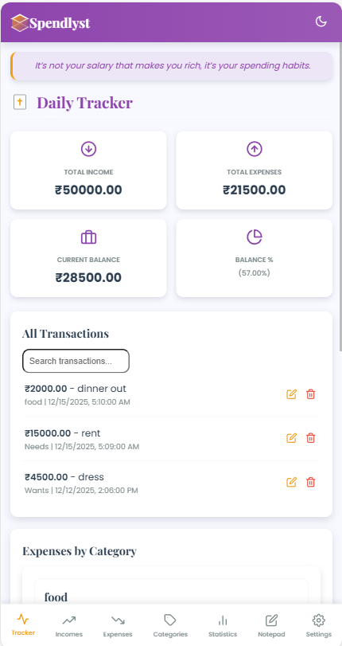
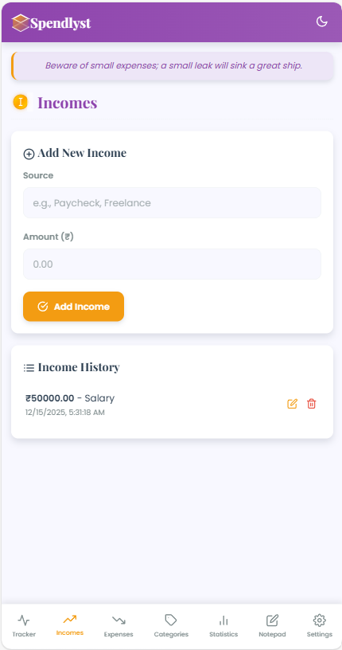
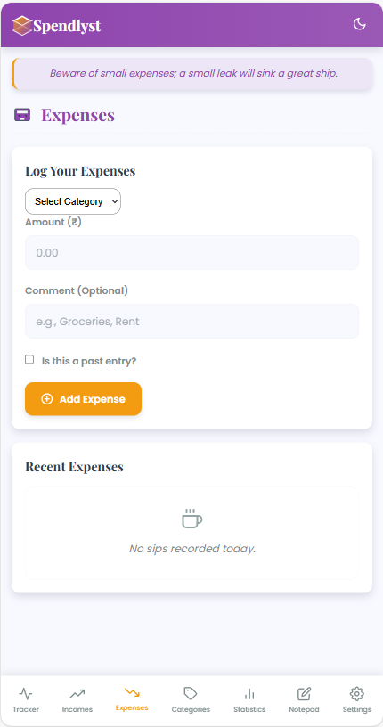
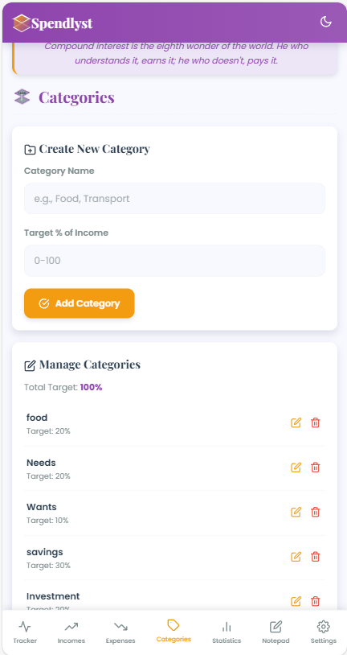
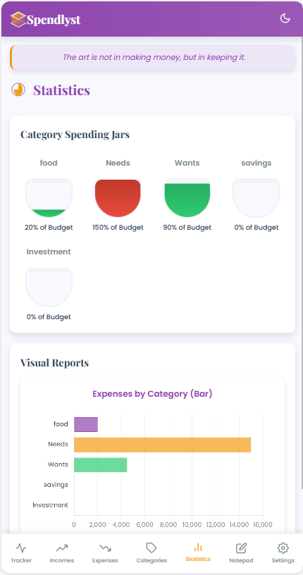
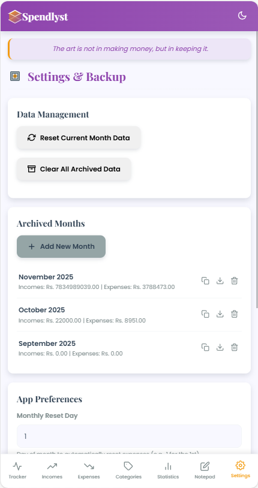

# 💰 Spendlyst – Smart Personal Expense Tracker

Spendlyst is a **lightweight, offline-first personal finance tracking application** designed to help users manage their **income, expenses, and monthly budgets** in a simple, secure, and efficient way.

The application is built with a **mobile-first approach**, focusing on usability, performance, and privacy. All user data is stored locally on the device.

---

## ✨ Key Features

* 📊 Track daily expenses with category & notes
* 💼 Manage multiple income sources
* 🧮 Automatic remaining balance calculation
* 📈 Monthly expense summaries & insights
* 💾 Offline-first local data storage
* 📤 Export data (PDF)
* 🔄 Monthly reset while preserving history
* 🚀 Fast startup with splash screen branding
* 🎨 Clean and responsive UI

---

## 📸 Screenshots

<p align="center">
  
  
  
</p>

<p align="center">
  
  
  
</p>

> *Screenshots demonstrate the core UI and major features of Spendlyst.*

---

## 🛠 Technology Stack

### Frontend

* HTML5
* CSS3 (mobile-first design)
* Vanilla JavaScript

### Android

* Android Studio
* WebView-based architecture
* Java (native integrations where required)

### Storage

* Browser LocalStorage (client-side)

---

## 📱 Platform Support

* ✅ Android (APK)
* ✅ Offline usage
* ❌ No backend required
* ❌ No cloud sync (privacy-focused)

---

## 🔐 Privacy & Security

Spendlyst respects user privacy:

* No internet dependency for core features
* No analytics or tracking
* No user accounts
* No data collection

All financial data remains **100% on the user’s device**.

---

## 🚀 Getting Started

### Clone the Repository

```bash
git clone https://github.com/Arunkumar-Ak43/Spendlyst.git
```

### Run the Application

* **Web:** Open `index.html` in a browser
* **Android:** Open project in Android Studio and run on device/emulator

---

## 📂 Project Structure

```
Spendlyst/
│
├── index.html
├── AndroidManifest.xml
├── screenshots/
│   ├── dashboard.png
│   ├── add-expense.png
│   ├── statistics.png
│   └── settings.png
├── README.md
└── LICENSE
```

---

## 📜 License

This project is licensed under the **MIT License**.

```
MIT License

Copyright (c) 2025 Arun Kumar
```

You are free to:

* Use
* Modify
* Distribute
* Sell

Provided the original copyright and license notice are included.
## License
MIT License — see [LICENSE](./LICENSE)

See the **LICENSE** file for full license text.

---

## 👨‍💻 Author

**Arun Kumar**
GitHub: [@Arunkumar-Ak43](https://github.com/Arunkumar-Ak43)

---

## 🤝 Contributing

Contributions are welcome!

1. Fork the repository
2. Create a feature branch
3. Commit your changes
4. Open a Pull Request

---

## ⭐ Support

If you find this project useful, please consider giving it a ⭐ on GitHub — it helps a lot!

---
